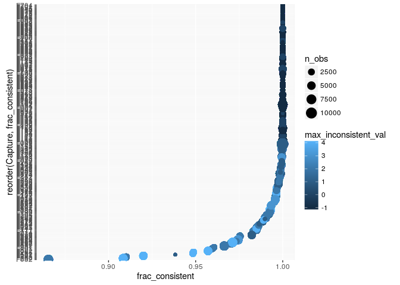
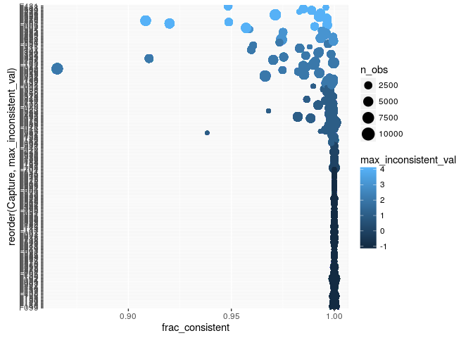
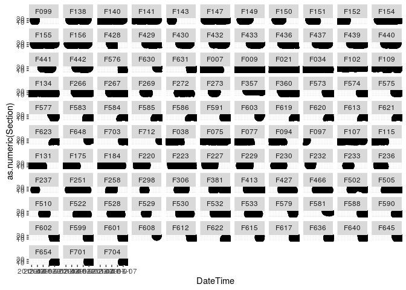
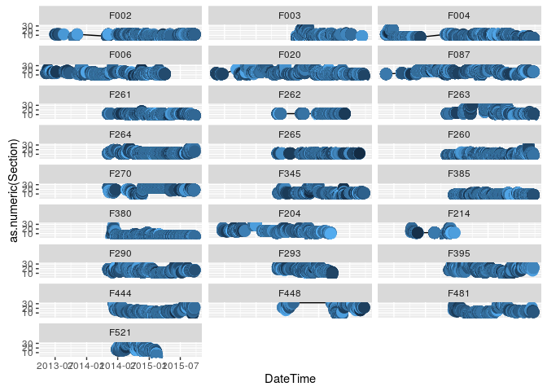
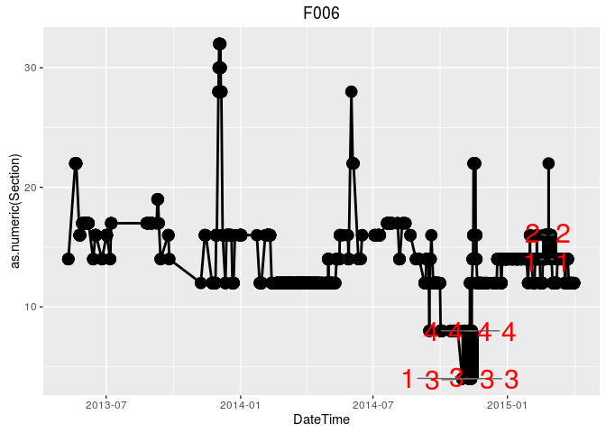

# qlexdatr_movement_consistency
Bernhard Konrad  
January 26, 2016  

We want to run a data quality analysis on the `qlexdatr` dataset to check for movement consistencies. We're mainly following the analysis done earlier for `klesdatr`. Eventually these scripts could be combined to work on either data set. However, unfortunately the data sets are not yet as coherent as they would need for be.

Later, in our mathematical model, we assume that, **at each time point, a fish can either stay in the current lake section or move to an adjacent section**. The goal of this analysis is to compute how accurate this simplication is by comparing to the observed data.


## Preparation

First, let's grab the data


```r
library(qlexdatr)
library(lexr)
library(tidyr)
library(spa)
library(dplyr)
library(ggplot2)

QLEX <- input_lex_data("qlexdatr")
QLEX_DETECT_DATA <- lexr::make_detect_data(QLEX, hourly_interval = 6L)
SECTIONS_FROM_TO <- QLEX_DETECT_DATA$distance
```

Next, we define a helper function for the distance between sections:


```r
distance_sections <- function(sectionA, sectionB) {
  # Returns pairwise distance between sections
  sectionA <- as.character(sectionA)
  sectionB <- as.character(sectionB)
  stopifnot(length(sectionA) == length(sectionB))

  res <- vector(mode="integer", length=length(sectionA))

  for (i in 1:length(res)) {
    if (is.na(sectionA[i]) | is.na(sectionB[i])) {
      res[i] = NA
    } else {
      res[i] <-   SECTIONS_FROM_TO %>%
        filter(SectionFrom == sectionA[i], SectionTo == sectionB[i]) %>%
        select(Distance) %>%
        as.integer()
    }
  }
  res
}

stopifnot(0 == distance_sections("S01", "S01"))
stopifnot(c(0, 0) == distance_sections(c("S01", "S01"), c("S01", "S01")))
```


For plotting we'll bring in the date information


```r
QLEX_DETECTION <- QLEX_DETECT_DATA$detection %>%
  dplyr::left_join(QLEX_DETECT_DATA$interval, by = c("IntervalDetection" = "Interval"))

QLEX_DETECTION %>%
  filter(as.character(Capture) == "F001") %>%
  ggplot(aes(x = DateTime, y = as.numeric(Section))) +
  geom_point() +
  geom_line()
```

 

## Calculate consistency and consistency_val

> By extension of our assumption a movement of a fish is **consistent** if the number of time intervals between detections does not exceed the distance between the sections that the fish was detected in.


We now calculate the difference between the detection times `TimeDiff` and the distance between locations `LocationDist`. We then add the logical variable `consistent` and `consistent_val` to indicate whether any one particular movement was consistent with our assumption, and if not, by how many lake sections (or days) we are off, respectively.


```r
QLEX_DETECTION %<>%
  group_by(Capture) %>%
  mutate(TimeDiff = IntervalDetection - lag(IntervalDetection)) %>%
  mutate(LocationDist = distance_sections(Section, lag(Section))) %>%
  filter(!is.na(TimeDiff)) %>%
  ungroup() %>%
  mutate(consistent = LocationDist <= TimeDiff) %>%
  rowwise %>%
  mutate(consistent_val = max(-1, as.integer(LocationDist - TimeDiff)))

glimpse(QLEX_DETECTION)
```

```
## Observations: 109,474
## Variables: 15
## $ IntervalDetection (int) 85, 86, 86, 88, 89, 90, 91, 92, 93, 93, 94, ...
## $ Section           (fctr) S20, S20, S20, S20, S20, S20, S20, S20, S20...
## $ Capture           (fctr) F014, F014, F015, F015, F015, F015, F015, F...
## $ Receivers         (int) 1, 1, 1, 1, 1, 1, 1, 1, 1, 1, 1, 1, 1, 1, 1,...
## $ Detections        (int) 2, 6, 3, 62, 26, 17, 5, 2, 48, 10, 30, 5, 30...
## $ Date              (date) 2013-05-08, 2013-05-08, 2013-05-08, 2013-05...
## $ Year              (int) 2013, 2013, 2013, 2013, 2013, 2013, 2013, 20...
## $ Month             (int) 5, 5, 5, 5, 5, 5, 5, 5, 5, 5, 5, 5, 5, 5, 5,...
## $ Hour              (int) 0, 6, 6, 18, 0, 6, 12, 18, 0, 0, 6, 6, 12, 0...
## $ DayteTime         (time) 2000-05-08 00:00:00, 2000-05-08 06:00:00, 2...
## $ DateTime          (time) 2013-05-08 00:00:00, 2013-05-08 06:00:00, 2...
## $ TimeDiff          (int) 2, 1, 2, 2, 1, 1, 1, 1, 9, 1, 1, 5, 1, 1, 1,...
## $ LocationDist      (int) 0, 0, 0, 0, 0, 0, 0, 0, 2, 0, 0, 0, 0, 0, 0,...
## $ consistent        (lgl) TRUE, TRUE, TRUE, TRUE, TRUE, TRUE, TRUE, TR...
## $ consistent_val    (dbl) -1, -1, -1, -1, -1, -1, -1, -1, -1, -1, -1, ...
```

The variable `consistent_val` shows how consistent or inconsistent the fish movement is. If `consistent_val > 0` then the fish movement is not consistent with our assumption that fish travel at most one section per day. In this case `consistent_val` says how many times, at least, the fish swam more than one section per day. E.g. if the fish was detected 3 sections away 2 days later, `consistent_val = 3-2 = 1`, if the fish was detected 10 sections away on the next day, then `consistent_val = 10-1 = 9`.

In contrast, `consistent_val = 0` indicated that the fish swam *on average* one section per day, that is, the fish was detected exactly $n$ sections aways $n$ days later, $n \geq 1$.

Finally, if the fish swam less than one section per day we set `consistent_val = -1`. That is, the fish was detected $k$ sections away $n$ days later, with $k < n$. We include the case where the fish was detected in the same section. In fact, this is the reason why we truncate at $-1$: Often fish don't seem to move at all, leading to large negative `consistent_val` values otherwise, which are not as informative. If a fish doesn't move it shouldn't matter if we detect it in the same section every day or not.

Note that `consistent_val` and `consistent` are both an underestimate of the error we make with our model assumption. It is possible that fish swim more than one section per day and are still listed as consistent, due to the non-perfect coverage. An inconsistent movement may not always be detected if the receiver in the violating section did not register the fast fish.


Here is a visualization of our result so far:


```r
QLEX_DETECTION %>%
  ggplot(aes(x = as.integer(TimeDiff), y = LocationDist)) +
  geom_abline(intercept = 0, slope = 1, size = 2, color = "red") +
  stat_sum(aes(size = ..n..), geom = "point") +
  scale_size_area(max_size = 10) +
  xlim(0, 15) +
  ylim(0, 15) +
  annotate("text", label = "Inconsistent movement", x = 3, y = 8, size=5)
```

```
## Warning: Removed 3130 rows containing non-finite values (stat_sum).
```

 

We see that the most observations are fish which are detected in the same section on the next day.


Here are a few more metrics that may be useful

```r
QLEX_DETECTION %>%
  summarise(frac_consistent = sum(consistent) / n()) %>%
  summarize(grand_mean = mean(frac_consistent))
```

```
## Source: local data frame [1 x 1]
## 
##   grand_mean
##        (dbl)
## 1  0.9636991
```

```r
QLEX_DETECTION %>%
  ggplot(aes(x = consistent_val, fill = consistent)) +
  geom_histogram(binwidth = 1)
```

 

## Understanding inconsistencies on a fish-by-fish basis

Next we want to better understand the inconsistent movements, where the largest `consistent_val` values are most concerning. To this end we add a couple consistency-related statistics to each fish.


```r
QLEX_DETECTION %<>%
  group_by(Capture) %>%
  mutate(n_obs = length(DateTime),
         n_consistent = sum(consistent),
         perc_consistent = sum(consistent)/length(consistent),
         mean_consistent_val = mean(consistent_val),
         max_consistent_val = max(consistent_val),
         median_consistent_val = quantile(consistent_val, 0.5)
  ) %>%
  ungroup()
```

```
## Warning: Grouping rowwise data frame strips rowwise nature
```

```r
QLEX_DETECTION %>%
  ggplot(aes(x = perc_consistent, y = reorder(Capture, perc_consistent))) +
  geom_point(aes(size = n_obs, color = max_consistent_val))
```

 

Or, plotting the same data sorted by their maximal consistent value:


```r
QLEX_DETECTION %>%
  ggplot(aes(x = perc_consistent, y = reorder(Capture, max_consistent_val))) +
  geom_point(aes(size = n_obs, color = max_consistent_val))
```

 

For starters, we see that there is a number of fish who are always consistent.

### Fish with perfect consistency


```r
QLEX_DETECTION %>%
  filter(perc_consistent == 1) %>%
  ggplot(aes(x = DateTime, y = as.numeric(Section))) +
  geom_line() +
  geom_point(size = 5) +
  facet_wrap(~ Capture)
```

```
## geom_path: Each group consists of only one observation. Do you need to
## adjust the group aesthetic?
```

 

We see that these 14442 fish are perfectly consistent, great!


### Fish with largest `consistent_val`, that is, the most inconsistent


```r
QLEX_DETECTION %>%
  filter(max_consistent_val >= max(QLEX_DETECTION$consistent_val) - 2) %>%
  ggplot(aes(x = DateTime, y = as.numeric(Section))) +
  geom_line(aes(size = consistent_val)) +
  geom_point(aes(size = 5, color = DateTime)) +
  facet_wrap(~ Capture, ncol = 2)
```

 

```r
QLEX_DETECTION %>%
  filter(max_consistent_val >= max(QLEX_DETECTION$consistent_val) - 2) %>%
  rowwise() %>%
  mutate(my_str = if (consistent_val > 0) as.character(consistent_val) else "") %>%
  ggplot(aes(x = DateTime, y = as.numeric(Section))) +
    geom_line(aes(size = consistent_val)) +
    geom_point(aes(size = 5)) +
    geom_text(aes(label = my_str), hjust = 1.5, size = 8) +
    facet_wrap(~ Capture)
```

 

